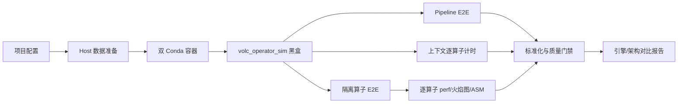
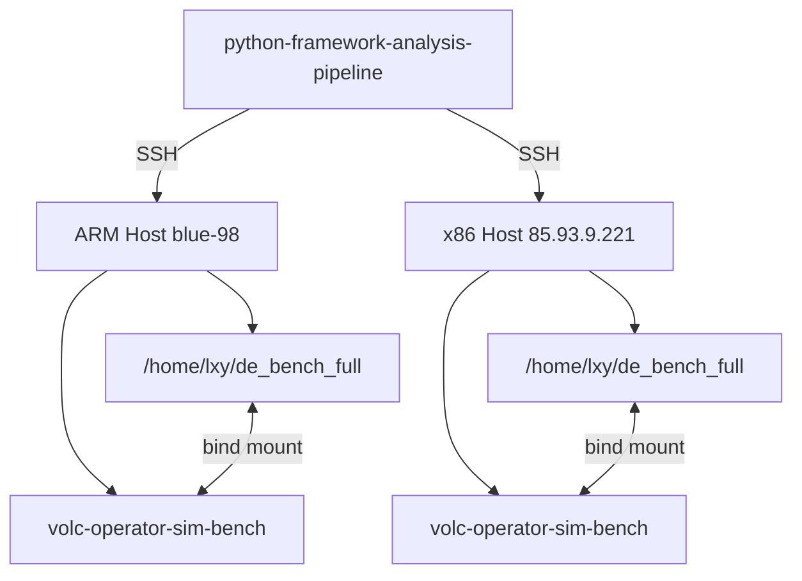
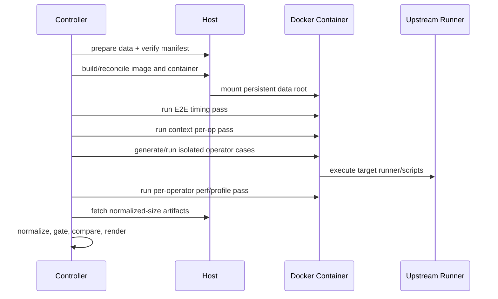
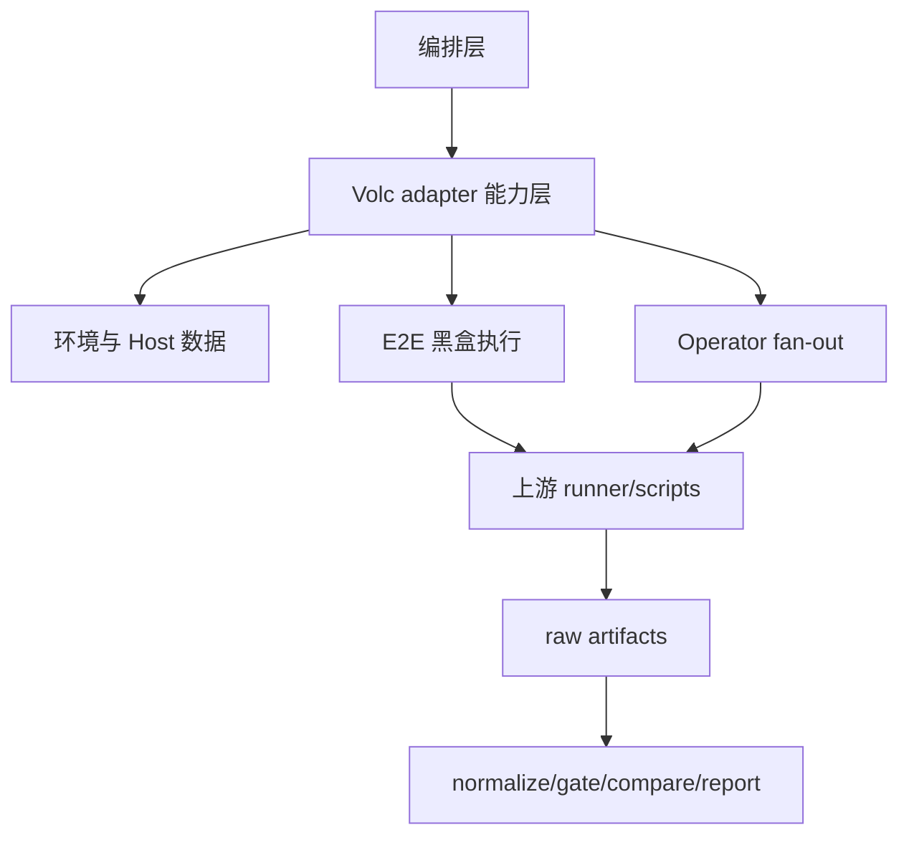

# Volc Operator Sim 黑盒适配架构设计说明书

## 0.1 产品版本&密级

- 产品：`python-framework-analysis-pipeline`
- 设计版本：1.0
- 设计基线日期：2026-07-16
- 密级：内部公开

## 0.2 拟制信息

- 拟制：Codex
- 评审对象：Python 框架分析流水线维护者、性能分析人员、测试环境维护者

## 0.3 修订记录

| 版本 | 日期 | 变更说明 |
|---|---|---|
| 1.0 | 2026-07-16 | 首版，覆盖黑盒接入、Host 持久数据、双 Conda 容器、E2E 与逐算子性能证据链 |

## 0.4 Keywords 关键词

Volc Operator Sim、Daft、Ray、Lance、Data-Juicer、逐算子、perf、跨架构、黑盒适配、Docker、Conda。

## 0.5 Abstract 摘要

本设计将 `volc_operator_sim` 作为外部 benchmark 黑盒接入现有 Python 框架分析流水线。ARM 与 x86 各运行一个包含 `xarch`、`xdj` 双 Conda 环境的容器；数据集、模型、canonical fixtures 与运行产物保存在 Host `/home/lxy/de_bench_full`，容器销毁不造成数据丢失。采集模型分为 Pipeline 端到端、Pipeline 上下文逐算子、隔离算子端到端与隔离算子 perf 归因四层，分别回答“整体多快、链路内慢在哪里、单个算子多快、CPU 时间花在哪里”。目标仓库业务执行逻辑不复制、不重写；本项目只负责环境编排、输入门禁、测量计划、artifact 发现、标准化和跨架构报告。

## 0.6 List of abbreviations 缩略语清单

| 缩略语 | 英文全称 | 中文名 |
|---|---|---|
| E2E | End-to-End | 端到端 |
| DJ | Data-Juicer | Data-Juicer 引擎 |
| PMU | Performance Monitoring Unit | 性能监控单元 |
| RSS | Resident Set Size | 常驻内存集 |
| IPC | Instructions Per Cycle | 每周期指令数 |
| DSO | Dynamic Shared Object | 动态共享对象 |
| DFX | Design for X | 可靠性、性能、安全等设计属性 |

## 0.7 前言

目标仓库已经具备 task/group、双引擎运行、perf-lock、golden、进程树采样和跨架构汇总能力。本设计不替换这些业务规则，而是补齐本项目所需的标准化目录、逐算子数据契约、perf/ASM 消费链和统一报告。

# 1 简介

## 1.1 目的

定义 `volc_operator_sim` 标准接入的架构边界、部署模型、数据所有权、测量语义、可靠性与安全约束，为后续实现和双平台实机验收提供唯一设计基线。

## 1.2 范围

范围包括：

- ARM `blue-98` 与 x86 `root@85.93.9.221:22` 的远程部署。
- 每个平台一个 Docker 容器，容器内同时提供 `xarch` 和 `xdj`。
- Host 预下载并持久化数据、模型、fixtures 与结果。
- 文本、视频、图像、音频、PDF、AD 六模态默认测试集的 `smoke` 一轮功能验收；原 `target_14` 完整矩阵保留为显式扩展测试集。
- Pipeline E2E、上下文逐算子、隔离算子 E2E、逐算子 perf/火焰图/ASM。
- artifact 标准化、ARM/x86 与 Daft/DJ 对比报告。

不包括：四层 Dataset/Source/Project 回填、前端数据同步、GitCode Issue bridge、GPU/NPU 正式性能结论。

## 1.3 文档结构

本文描述系统级架构；配套功能设计描述各功能域；详细设计定义配置、状态机、目录和数据结构。

## 1.4 利益相关人

| 角色 | 关注点 |
|---|---|
| 流水线维护者 | adapter 边界、兼容性、可测试性 |
| 性能分析人员 | 指标语义、逐算子证据、跨架构可比性 |
| 测试环境维护者 | Host 数据持久化、镜像、权限、磁盘占用 |
| 业务仓库维护者 | 上游脚本不被复制或重写、revision 可追溯 |

## 1.5 对已有架构的借鉴与反思

借鉴现有 `udfbenchmarking` adapter 的“外部仓库 + 独立镜像 + 标准化产物”模式，但不沿用其单一 CSV benchmark 假设。目标仓库已有丰富 artifact，适配器应消费现有事实而非再次实现 runner。现有 `FrameworkAdapter` 只有整体 benchmark 与 perf attach 接口，无法自然表达逐算子 fan-out，因此新增可选的 `OperatorAnalysisAdapter` 扩展协议，避免破坏已有 adapter。

# 2 概念模型

四类测量不可混用：

| 层级 | 测量对象 | 主要回答 | 是否可直接作为纯算子耗时 |
|---|---|---|---|
| L0 | 完整 Pipeline | 整体 E2E 多快 | 否 |
| L1 | Pipeline 内 operator/execution group | 链路内慢在哪里 | 仅高质量真实边界可用 |
| L2 | 单算子 case 完整命令 | 该算子 case 的 E2E 多快 | 含启动、读取、物化开销 |
| L3 | 单算子 `perf.data` | CPU 样本分布在哪里 | 是 CPU-time 分布，不是 wall-clock 分布 |

# 3 架构和关键质量属性目标

## 3.1 架构目标

1. 上游业务执行保持黑盒，revision 固定且可替换。
2. Host 数据生命周期独立于容器生命周期。
3. Pipeline 与逐算子数据均可追溯到 revision、镜像 digest、输入 fingerprint、平台和引擎。
4. timing 与 profiling 分离，避免 perf record 污染公平 E2E。
5. 对无法准确归因的数据显式降级，不生成伪精确结论。

## 3.2 关键架构需求

- `REQ-ARCH-001`：两个平台使用相同目标仓库 revision 和等价 Conda lock。
- `REQ-ARCH-002`：每个非 sink 业务算子至少产生一条上下文计时记录。
- `REQ-ARCH-003`：可隔离算子产生独立 E2E、perf.data、符号/类别分布和质量状态。
- `REQ-ARCH-004`：Daft 与 DJ 对比前必须验证同一 operator stage 输入 fingerprint。
- `REQ-ARCH-005`：smoke/attribution 数据不得被标记为正式 scale 性能结论。

## 3.3 假设和约束

- 目标仓库设计基线固定为 commit `56d3b6856895427a0519cbaa437d55443fcb578b`，配置可显式覆盖。
- 目标仓库 `unblock_perf=false` 时，只输出功能与诊断结论。
- ARM 与 x86 Host 均能通过 SSH 访问并具备 Docker、磁盘和 perf 权限。
- 本项目 YAML 解析器不支持 flow-style map/list，新增配置全部使用缩进块。
- DJ 当前上下文逐算子耗时可能来自日志或 `estimated_even_split`；后者必须标为低可信，不进入逐算子速度结论。

### 3.3.1 生命周期约束

- raw/model/fixture 缓存由 Host 管理，可跨镜像与容器复用。
- 容器和镜像可重建；运行产物按 run id 永久落到 Host，默认不自动删除。
- 上游 revision、Conda lock 或数据 manifest 变化时创建新 cache namespace，不覆盖旧事实。

# 4 架构原则

1. 事实优先：原始 result、perf.data、日志不可被标准化结果替代。
2. 语义隔离：E2E、上下文逐算子、隔离算子和 CPU sample share 分开存储。
3. 输入先行：没有 fingerprint/parity 就不做跨引擎或跨架构判决。
4. 测量分离：timing、perf stat、perf record、py-spy 使用独立跑次。
5. 幂等部署：Host 下载、fixture 构建、镜像构建和 artifact fetch 都支持断点续跑。
6. 保守降级：样本不足、PMU 不支持、边界不真实时输出 `warn/unsupported`，不估造数据。

# 5 系统用例模型

## 5.1 上下文模型

### 5.1.1 上下文图

### 5.1.2 外部接口描述

| 外部系统 | 接口 | 数据 |
|---|---|---|
| GitCode | HTTPS clone/fetch | 固定 revision 源码 |
| 数据源/模型源 | HTTPS/对象存储下载 | raw dataset、model blobs、checksum |
| ARM/x86 Host | SSH | PlanStep、状态、artifact |
| Docker | CLI | image/container 生命周期、bind mount |
| perf | CLI/文件 | perf stat、perf.data、perf script、annotate |

## 5.2 关键系统用例模型

### 5.2.1 需求编号：REQ-USE-001 双平台全量采集

#### 5.2.1.1 关键系统用例

用户执行一次默认项目 run，系统完成 Host 准备、容器部署、六模态代表 Pipeline smoke、逐算子 fan-out、perf 归因、artifact 回收和跨平台报告；需要完整覆盖时显式选择十四条扩展项目。

#### 5.2.1.2 交互场景

# 6 关键技术方案设计

## 6.1 黑盒执行与证据增强方案

目标仓库的 task、operator registry、Daft/DJ runner 和 perf-lock 继续作为业务真值。本项目新增 overlay 配置和派生 operator task，但不复制 operator 实现。派生 task 仍调用目标仓库 `runner/run_perf_suite.py` 或正式 shell 入口。

逐算子采用双证据链：

- 上下文证据：读取目标 result 的 `operator_timings`、`op_boundaries`、`timing_breakdown`。
- 隔离证据：为每个 operator 生成 stage input + 单算子 task，分别跑 timing 与 perfrecord。

严格黑盒下，DJ 缺少可靠上下文时间窗口，不能从整条 Pipeline 的 perf.data 准确切出 DJ 单算子样本。因此 DJ 的逐算子 perf 以隔离 case 为权威；Daft 的上下文窗口仅作为辅助交叉验证。

## 6.2 Host 数据持久化方案

Host prepare 使用可恢复下载、`.partial` 临时文件、checksum 校验和原子 rename。镜像不包含数据。容器内 fixture 构建写回 Host mount；真实 `raw/` 保持只读，上游 builder 的 `raw/min_fixtures` 通过嵌套挂载持久化到 Host `fixtures/raw/`。容器重建不会丢失 raw、models、fixtures、operator stage snapshots 或结果。

## 6.3 AI架构技术方案

不涉及。系统不使用生成式 AI 作性能分类或结论判决。

# 7 逻辑架构

## 7.1 结构模型

### 7.1.1 架构模式

采用 Adapter + Capability Extension + Artifact Pipeline：基础 `FrameworkAdapter` 负责 E2E，`OperatorAnalysisAdapter` 作为可选能力负责逐算子计划和采集。

### 7.1.2 1层-n层逻辑模型

### 7.1.3 逻辑接口设计

- `FrameworkAdapter`：部署、E2E benchmark、整体 perf、timing normalize。
- `OperatorAnalysisAdapter`：operator plan、context timing、isolated timing、operator profile、artifact normalize。
- `HostDataPreparer`：prepare/verify/manifest。
- `OperatorArtifactNormalizer`：目标 schema 转本项目 operator schema。

## 7.2 行为模型

### 7.2.1 用例设计1：首次部署

下载 Host 数据，构建双 Conda 多架构镜像，启动容器，构建/校验 canonical fixtures，记录 readiness。

### 7.2.2 用例设计2：断点续跑

根据 `pipeline-run.json`、Host download manifest、image digest 和 operator acquisition manifest 跳过完整 artifact；不完整目录被隔离后重跑对应最小单元。

## 7.3 数据模型

### 7.3.1 架构模式

原始事实不可变，标准化数据可重建，报告为派生物。

### 7.3.2 关键数据设计

| 数据 | 权威来源 | 所有者 |
|---|---|---|
| task/operator 定义 | 目标仓库固定 revision | 目标仓库 |
| raw/model/fixture | Host data root | 环境层 |
| result/perf/log | 每次 run artifact | 采集层 |
| normalized operator records | 本项目转换器 | 分析层 |
| report | normalized records | 展示层 |

### 7.3.3 静态数据结构模型

主键为 `run_id/platform/task_id/engine_id/operator_case_id/measurement_scope`。`measurement_scope` 至少包含 `pipeline_e2e`、`pipeline_context`、`operator_case_e2e`、`operator_case_perf`。

### 7.3.4 数据所有权模型

Host 目录是数据和远程 artifact 的持久所有者；Controller run directory 是本项目标准化 artifact 的所有者；容器只拥有可丢弃的环境状态。

## 7.4 逻辑元素清单

| 元素 | 职责 |
|---|---|
| VolcEnvironmentAdapter | Host、镜像、容器和 readiness |
| VolcOperatorSimAdapter | E2E 黑盒运行和整体 artifact |
| OperatorAnalysisAdapter | 逐算子采集能力协议 |
| OperatorPlanner | task 展开、stage input 和 operator case |
| ArtifactNormalizer | timing/perf/resource 标准化 |
| OperatorCompareRenderer | 引擎/架构逐算子报告 |

# 8 实现架构

## 8.1 实现元素模型

### 8.1.1 模型设计

新增包 `pipelines/pyframework_pipeline/adapters/volcoperatorsim/`，独立保存环境、执行、operator 计划和 artifact 解析逻辑。

### 8.1.2 实现元素清单

| 元素 | 建议文件 |
|---|---|
| 基础 adapter | `adapter.py` |
| 环境 adapter | `environment.py` |
| Host prepare | `scripts/prepare-host-data.sh` |
| 镜像构建 | `scripts/build-volcoperatorsim-image.sh` |
| operator 计划 | `operator_plan.py` |
| artifact 发现 | `artifacts.py` |
| 标准化 | `normalize.py` |
| operator 合同 | `contracts/operator.py` |
| operator 报告 | `analyze/render_operator_compare_report.py` |

### 8.1.3 实现元素规格视图输出策略

接口、状态机、目录和字段在详细设计中给出；代码实现不得扩大到四层回填或 bridge。

## 8.2 技术模型

### 8.2.1 运行框架

Controller 使用 Python 标准库 CLI；远端使用 Docker、Miniforge、目标仓库脚本与 Python runner。

### 8.2.2 通信框架

Controller 通过现有 SSH executor 执行命令和按目录回收 artifact；数据集不经过 Controller 中转。

### 8.2.3 OM框架

使用 `pipeline-run.json`、download manifest、environment record、acquisition manifest 和日志实现运维可观测性。

### 8.2.4 其他实现元素技术模型

perf record/stat、py-spy、psutil、objdump/readelf、target compare scripts。

### 8.2.5 接口实现机制清单

Python Protocol、JSON/JSONL/CSV 文件契约、CLI 环境变量、Docker bind mount。

### 8.2.6 技术选型

- 镜像：同一 Dockerfile 在 ARM/x86 Host 原生构建。
- Conda：Miniforge，按目标仓库 pin 创建 `xarch` 与 `xdj`。
- perf：优先 Host 匹配版本 bind mount；否则镜像内版本通过 readiness 验证。
- 报告：Markdown + CSV + JSON，复用现有 perf 分类/ASM 分析模块。

### 8.2.7 开源策略

目标仓库只按 revision 拉取，不 vendor；镜像记录源码 revision 和依赖 lock；遵守上游许可证。

## 8.3 数据模型

### 8.3.1 架构模式

Raw → Normalized → Aggregated → Report 四层，任何后层可从前层重建。

### 8.3.2 关键数据机制设计

所有标准化记录携带 `source_artifacts`、`quality` 和 `measurement_scope`，防止把估算值当实测值。

## 8.4 代码模型

### 8.4.1 模型设计

适配器仅依赖公共 contracts、remote executor 和分析模块；不得从 orchestrator 复制命令执行逻辑。

### 8.4.2 代码元素清单

见 8.1.2；同时修改 adapter/environment 注册、config 校验、可选 operator step、测试和 README。

## 8.5 构建模型

### 8.5.1 模型设计

每个平台原生构建镜像，tag 为 `volc-operator-sim-bench:<revision12>-<arch>`；最终环境记录 image id/digest。

### 8.5.2 构建元素清单

Dockerfile 生成脚本、Miniforge 安装器、Conda specs、系统依赖、目标源码 revision、readiness probes。

### 8.5.3 硬件模型

ARM aarch64 与 x86_64 CPU Host；perf PMU 能力按平台探测，不假设事件完全一致。

## 8.6 交付模型

### 8.6.1 模型设计

交付代码、参考项目配置、Host prepare 脚本、镜像构建脚本、单元/集成测试、远程 smoke 记录和设计文档。

### 8.6.2 交付元素清单

新增 adapter 包、operator contract、参考项目 `projects/volc-operator-sim-reference/`、测试、运行说明和报告样例。

### 8.6.3 软件包命名格式

- Image：`volc-operator-sim-bench:<revision12>-<arch>`
- Container：`volc-operator-sim-bench`
- Run：`volc-operator-sim-<UTC timestamp>-<revision12>`

## 8.7 部署模型

### 8.7.1 部署节点及规格定义

| 节点 | 容器 | Host 数据根 | 引擎环境 |
|---|---|---|---|
| ARM `blue-98` | 1 | `/home/lxy/de_bench_full` | `xarch` + `xdj` |
| x86 `85.93.9.221` | 1 | `/home/lxy/de_bench_full` | `xarch` + `xdj` |

### 8.7.2 模型设计

raw/models 默认只读挂载；fixtures/operator-cache/bench-results 读写挂载。Ray 使用显式 `--shm-size`。perf 优先最小 capabilities，内核不支持时才退回 `--privileged`，并记录安全降级。

## 8.8 运行模型

### 8.8.1 并发、并行设计

平台间可并行；同一平台 timing 与 profiling 串行，避免资源相互污染；operator case 默认串行，允许在互斥 CPU set 上受控并行。

### 8.8.2 运行交互分析

#### 8.8.2.1 用例设计1：E2E pass

调用 `run_all_pipelines.sh`，按 task × engine 产生原始结果，随后标准化整体 timing。

#### 8.8.2.2 用例设计2：operator pass

读取 task，先采上下文计时，再按 operator plan 生成 stage snapshot 和单算子 case，分别跑 timing/perfrecord，最后汇总 operator records。

# 9 基于架构的安全/韧性/隐私/可靠/可用/Safety等属性分析

## 9.1 安全/韧性威胁分析

### 9.1.1 价值资产清单/列表

SSH 凭据、Host 数据集、模型缓存、性能结果、源码 revision、镜像供应链。

### 9.1.2 暴露面清单/列表

远程 SSH、外部下载 URL、Docker daemon、特权 perf 权限、目标仓库执行代码。

### 9.1.3 攻击路径模型

#### 9.1.3.1 Host 数据资产攻击路径

恶意下载内容或被篡改源码通过容器写入 Host mount。控制措施为 URL allowlist、checksum、固定 revision、非必要目录只读和独立 results namespace。

#### 9.1.3.2 架构元素分类列表

Controller 为控制域；Host prepare 为数据域；容器为可丢弃执行域；raw/model 为只读资产域；results 为写入域。

### 9.1.4 韧性控制点清单/列表

下载校验、atomic rename、image digest、readiness、artifact complete marker、resume、磁盘水位检查。

### 9.1.5 安全韧性威胁模型

主要威胁是供应链污染、误删 Host 数据、特权容器逃逸和错误性能结论。

### 9.1.6 安全韧性逻辑模型

最小权限 + 不可变输入 + 可丢弃容器 + 可追溯 artifact + 质量门禁。

## 9.2 安全模型

### 9.2.1 0~n层安全设计框架

#### 9.2.1.1 初始化过程安全

不把 token/SSH key 写入镜像；下载地址与 checksum 由配置提供；构建日志屏蔽敏感环境变量。

#### 9.2.1.2 运行安全域

容器只挂载必要子目录；results 使用 run namespace；Host prepare 不执行数据包中的脚本。

#### 9.2.1.3 防绕过

缺失 revision、checksum、input fingerprint 或 perf-lock 时，比较步骤失败或隔离结果。

#### 9.2.1.4 自保护

磁盘不足、目录越界、符号链接逃逸和未知 URL 直接失败。

### 9.2.2 1~n层子系统安全模型

不涉及额外安全子系统。

## 9.3 安全/韧性部署模型

默认使用 `CAP_PERFMON`、`CAP_SYS_PTRACE` 与必要 seccomp 放行；无法工作时使用特权容器作为显式、可审计的兼容模式。

## 9.4 可靠性属性分析模型

下载、构建和采集均以 manifest + complete marker 判断完成；目录存在但内容不完整不能作为 checkpoint。

## 9.5 公共组件安全配置分析

Docker daemon、SSH、Git 和下载工具沿用 Host 安全策略；本设计不开放网络服务端口。

# 10 组件化或服务化架构6独立能力

| 能力 | 设计结论 |
|---|---|
| 独立部署 | 环境 adapter 与业务 adapter 分离 |
| 独立升级 | revision/image/data namespace 可独立演进 |
| 独立伸缩 | 平台和 operator case 可按资源受控并行 |
| 独立故障 | 单 operator case 失败不抹除其他 artifact |
| 独立测试 | planner、normalizer、renderer 可离线测试 |
| 独立观测 | 每阶段有 manifest、日志、状态和质量字段 |

# 11 其他说明

`perf` sample/period share 是 CPU 样本分布，不等同 wall-clock 占比。可以计算 `estimated_cpu_time_s = tree_cpu_time_s × period_share`，但必须带 `estimated` 标签，禁止回填为算子端到端耗时。

# 12 参考资料清单

1. `README.md` 与 `pipelines/pyframework_pipeline/README.md`。
2. `pipelines/pyframework_pipeline/contracts/adapter.py`。
3. `pipelines/pyframework_pipeline/contracts/timing.py`。
4. `pipelines/pyframework_pipeline/analyze/perf_analysis_common.py`。
5. `volc_operator_sim` commit `56d3b6856895427a0519cbaa437d55443fcb578b`。
6. 目标仓库 `docs/design/DATAFLOW_ARCHITECTURE_DESIGN.md`、`WORKLOAD_WALLCLOCK_ATTRIBUTION_DESIGN.md`、`PERF_LOCK_DESIGN.md`。
