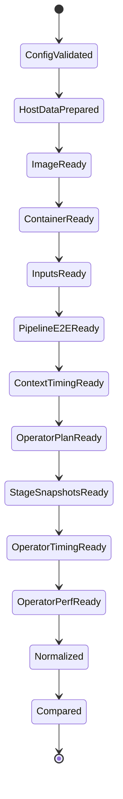

# Volc Operator Sim 黑盒适配详细设计说明书

## 0.1 产品版本&密级

- 产品：`python-framework-analysis-pipeline`
- 设计版本：1.0
- 日期：2026-07-16
- 密级：内部公开

## 0.2 拟制信息

- 拟制：Codex
- 适用范围：标准接入、逐算子采集、双平台实机验收

## 0.3 修订记录

| 版本 | 日期 | 变更说明 |
|---|---|---|
| 1.0 | 2026-07-16 | 首版，给出可实施的配置、接口、流程、数据和验收设计 |

## 0.4 Keywords 关键词

Adapter、OperatorAnalysisAdapter、operator case、stage snapshot、perf.data、quality gate、resume。

## 0.5 Abstract 摘要

本详细设计定义 `volcoperatorsim` adapter 的文件组织、配置结构、Host prepare 状态机、双 Conda 镜像、E2E/逐算子执行算法、artifact 目录、标准化 schema、perf 分布计算、质量等级、错误处理和测试验收。设计的关键点是同时保存 Pipeline 上下文数据和隔离 operator case 数据：前者解释真实链路中的成本，后者提供可独立复现的 operator E2E、perf、火焰图和机器码证据。

## 0.6 List of abbreviations 缩略语清单

| 缩略语 | 英文全称 | 中文名 |
|---|---|---|
| ROI | Region of Interest | 归因有效区间 |
| E2E | End-to-End | 端到端 |
| CV | Coefficient of Variation | 变异系数 |
| PMU | Performance Monitoring Unit | 性能监控单元 |
| DSO | Dynamic Shared Object | 动态共享对象 |

## 0.7 简介

目标仓库基线为 `56d3b6856895427a0519cbaa437d55443fcb578b`。实现不得把目标 operator 或 runner 复制进本项目；允许生成 overlay config、派生 task 和采集 wrapper。

# 1 上游文档引用

1. `2026-07-16-volc-operator-sim-adaptation-architecture.md`。
2. `2026-07-16-volc-operator-sim-adaptation-function.md`。
3. 本项目 `contracts/adapter.py`、`contracts/timing.py`、`analyze/perf_analysis_common.py`。
4. 目标仓库 `README.md`、`docs/design/DATAFLOW_ARCHITECTURE_DESIGN.md`。
5. 目标仓库 `docs/design/WORKLOAD_WALLCLOCK_ATTRIBUTION_DESIGN.md`、`PERF_LOCK_DESIGN.md`。

# 2 实现设计：总体代码与配置

## 2.1 实现概述

新增包：

```text
pipelines/pyframework_pipeline/
  adapters/volcoperatorsim/
    __init__.py
    adapter.py
    environment.py
    config.py
    operator_plan.py
    artifacts.py
    normalize.py
    scripts/
      prepare-host-data.sh
      build-volcoperatorsim-image.sh
      container-readiness.sh
  contracts/operator.py
  analyze/operator_compare.py
  analyze/render_operator_compare_report.py
  cli/operator.py
```

新增参考项目：

```text
projects/volc-operator-sim-reference/
  project.yaml
  environment.yaml.example
  data-sources.json
  workload/
    README.md
```

## 2.2 关键算法与流程

基础 `FrameworkAdapter` 保持兼容；新增可选协议：

```python
@runtime_checkable
class OperatorAnalysisAdapter(Protocol):
    def operator_capabilities(self) -> OperatorCapabilities: ...
    def plan_operator_cases(self, project_path, run_dir, platform) -> Path: ...
    def collect_context_timing(self, project_path, run_dir, platform, force=False) -> Path: ...
    def collect_operator_timing(self, project_path, run_dir, platform, force=False) -> Path: ...
    def collect_operator_profiles(self, project_path, run_dir, platform, force=False) -> Path: ...
    def normalize_operator_artifacts(self, run_dir, platform) -> Path: ...
```

Orchestrator 只在 adapter 满足该协议且项目配置启用 `operatorAnalysis` 时插入 operator subflow，已有 adapter 无需实现空方法。

## 2.3 行为模型

### 2.3.1 正常流程



### 2.3.2 异常流程

- Host prepare、image、container、input parity 失败：阻断所有 benchmark。
- 单 task E2E 失败：停止该平台后续 operator fan-out，保留诊断。
- 单 operator case 失败：标记 case failed，其他 case 继续。
- profile 失败：保留 timing，operator quality 降级；不删除 result。
- cross-platform parity 失败：生成单平台报告，但不计算 speedup。

## 2.4 数据模型

### 2.4.1 数据结构定义

配置必须使用 block-style YAML：

```yaml
id: volc-operator-sim-reference
name: Volc Operator Sim Reference
fourLayerRoot: .

workload:
  benchmark: volc-operator-sim
  group: core_dual_engine
  profile: smoke
  rounds: 1
  timeout: 14400
  operatorAnalysis:
    enabled: true
    contextTiming: true
    isolatedTiming: true
    profiling: true
    warmup: 1
    rounds: 3
    minPerfSamples: 5000
    topSymbols: 20

run:
  platforms:
    - arm
    - x86
```

环境配置关键字段：

```yaml
schemaVersion: 1
framework: volcoperatorsim
mode: plan-only

software:
  volcOperatorSimRepo: https://gitcode.com/XuanYuL5/volc_operator_sim.git
  volcOperatorSimRevision: 56d3b6856895427a0519cbaa437d55443fcb578b
  volcOperatorSimImages:
    arm: volc-operator-sim-bench:56d3b6856895-aarch64
    x86: volc-operator-sim-bench:56d3b6856895-x86_64
  volcOperatorSimContainer: volc-operator-sim-bench
  hostDataRoot: /home/lxy/de_bench_full
  dataSourceManifest: data-sources.json
  daftCondaEnv: xarch
  dataJuicerCondaEnv: xdj
  shmSize: 64g
  perfFrequency: 99
  perfEvents: cycles,instructions,cache-references,cache-misses,L1-dcache-loads,L1-dcache-load-misses,LLC-loads,LLC-load-misses,branches,branch-misses,context-switches,cpu-migrations,page-faults
  profilingTools:
    - perf
    - objdump
    - readelf
    - py-spy
```

`hostRefs` 沿用 ARM `blue-98` 与 x86 `root@85.93.9.221:22`。

`schemas/environment.schema.json` 的 `software.additionalProperties=false`，因此实施必须同步新增并校验上述 Volc 字段：repo 为 URI、revision 为 40 位 hex、images 至少包含 `arm/x86`、Host 根为绝对路径、Conda env 名非空、perf frequency 为正整数。`workload.operatorAnalysis` 目前可由项目扩展字段承载，但 adapter preflight 仍必须对 rounds/warmup/sample/top-N 做类型和范围校验，不能因 `project.schema.json` 允许扩展而跳过语义校验。

### 2.4.2 数据流转

配置 → PlanStep → remote command → raw target artifact → acquisition manifest → normalized records → validation → comparison → report。

## 2.5 接口设计

### 2.5.1 内部接口设计

`OperatorAnalysisAdapter` 以文件路径作为跨阶段接口，避免跨 SSH 保留进程对象。所有返回文件必须包含 schema version、revision 和 run id。

### 2.5.2 内部接口定义

`OperatorCapabilities`：

```text
context_timing: bool
isolated_timing: bool
operator_perf: bool
operator_flamegraph: bool
operator_asm: bool
stage_snapshot: bool
```

`OperatorPlan`、`OperatorRecord` 和 manifest 详见后续章节。

## 2.6 代码实现要点

- adapter 注册 id 为 `volcoperatorsim`，展示名为 `Volc Operator Sim`。
- config/preflight 不再为每个 framework 复制大量分支；新增部分优先通过 adapter capability 查找 image/container。
- 现有工作树存在大量行尾变化，实施时仅做小范围 patch，不整文件格式化。
- 目标仓库 revision 是配置输入；normalize 必须拒绝缺少 revision 的 artifact。

# 3 实现设计：Host 数据准备与容器部署

## 3.1 实现概述

Host 是数据生命周期所有者。容器镜像只包含代码和环境。数据准备阶段先下载 raw/model，再启动容器构建 canonical fixtures 与 operator stage snapshots。

## 3.2 关键算法与流程

### 3.2.1 下载算法

```text
for source in manifest:
  validate target is under hostDataRoot
  acquire file lock
  if final file hash matches: mark reused
  else download to <target>.partial with resume
  verify size and sha256
  fsync and atomic rename
  append manifest entry atomically
```

下载 manifest 示例：

```json
{
  "schemaVersion": 1,
  "profile": "core_dual_engine",
  "generatedAt": "2026-07-16T00:00:00Z",
  "entries": [
    {
      "sourceId": "fineweb-text",
      "url": "configured-source-url",
      "path": "raw/fineweb",
      "expectedSha256": "configured-sha256",
      "actualSha256": "verified-sha256",
      "status": "complete"
    }
  ]
}
```

首轮 smoke 的媒体与文本输入由上游 fixture builder 合成，因此 reference manifest 可以是空 `entries`；fair/scale profile 必须补充真实 URL/path/sha256，禁止把未知源自动下载到真实主机。

### 3.2.2 容器 reconcile 算法

1. image 不存在，或 `pyframework.volc.revision` label 与配置 revision 不一致：构建。
2. container 不存在：创建。
3. container image/config hash 不匹配（hash 包含 repo、revision、双 Conda 名、数据根和 shm）：停止并重建容器，不删 Host mount。
4. image 相同但 stopped：启动。
5. image/运行参数相同且 running：复用。

### 3.2.3 挂载设计

```text
Host raw/            -> container /home/lxy/de_bench_full/raw:ro
Host models/         -> container /home/lxy/de_bench_full/models:ro
Host fixtures/       -> container /home/lxy/de_bench_full/fixtures:rw
Host fixtures/raw/   -> container /home/lxy/de_bench_full/raw/min_fixtures:rw
Host operator-cache/ -> container /home/lxy/de_bench_full/operator-cache:rw
Host bench-results/  -> container /home/lxy/de_bench_full/bench-results:rw
Host manifests/      -> container /home/lxy/de_bench_full/manifests:rw
```

## 3.3 行为模型

### 3.3.1 正常流程

ARM/x86 可并行执行 prepare；单 Host 内使用锁串行修改同一 cache namespace。镜像内双 Conda 环境可用后运行上游 fixture builder；构建三个 canonical media Lance/mirror/meta 并执行 `check_input_parity.py --require-canonical-media`，通过后才完成最终 readiness。真实 `raw/` 始终只读，builder 所需的 `raw/min_fixtures` 由嵌套可写挂载落到 Host `fixtures/raw/`。

### 3.3.2 异常流程

- checksum mismatch：移入 `quarantine/`，不得覆盖 final。
- 磁盘可用空间低于配置阈值：提前失败。
- perf permission denied：environment readiness 失败或按显式配置降级为 timing-only。
- Host perf 与镜像 perf 不兼容：使用配置的 Host perf bind mount 路径重建容器。

## 3.4 数据模型

### 3.4.1 数据结构定义

`environment-record.json` 新增：

```json
{
  "sourceRevision": "56d3b6856895427a0519cbaa437d55443fcb578b",
  "imageId": "sha256:...",
  "containerId": "...",
  "dataManifestSha256": "...",
  "condaFingerprints": {
    "xarch": "...",
    "xdj": "..."
  },
  "perf": {
    "version": "...",
    "cyclesAvailable": true,
    "callGraphAvailable": true
  }
}
```

### 3.4.2 数据流转

Host source manifest → verified files → fixture builder → input fingerprint manifest → benchmark mount。

## 3.5 接口设计

### 3.5.1 内部接口设计

PlanStep 的 `scriptPath` 指向 adapter 内脚本；环境部署复用现有 upload + remote execution 机制。

### 3.5.2 内部接口定义

| Step id | 产物 | 可恢复条件 |
|---|---|---|
| `prepare-volc-host-data` | Host download manifest | 所有 required entry complete |
| `build-volc-image` | image id | tag 指向期望 image id |
| `start-volc-container` | container id | image/mount/capability 一致 |
| `build-volc-fixtures` | fixture manifest | fingerprint 一致 |
| `readiness-volc` | readiness record | 所有 required probe pass |

## 3.6 代码实现要点

- Shell 脚本使用 `set -euo pipefail`，所有路径用引号。
- 下载逻辑不得使用 `rm -rf` 清理根目录；只处理 manifest 明确列出的 `.partial`。
- 数据源清单与镜像构建解耦，换数据不触发重建镜像。
- 镜像构建记录 `conda list --explicit`，便于两架构比较。

# 4 实现设计：E2E 与上下文逐算子采集

## 4.1 实现概述

E2E pass 复用目标正式 group runner。上下文 pass 逐 task 执行 attribution profile，以现有 `operator_timings`、`op_boundaries`、`api_timings`、`timing_breakdown` 为原始事实。

## 4.2 关键算法与流程

### 4.2.1 E2E pass

```text
OUT_ROOT=<host>/bench-results/pyframework/<run_id>/<arch>/pipeline-e2e
GROUP=core_dual_engine
PROFILE_NAME=smoke
ROUNDS=1
bash scripts/pipelines/run_all_pipelines.sh
```

每个平台使用全新 OUT_ROOT。Adapter 不从全局 bench-results 递归汇总历史文件。

### 4.2.2 Context pass

逐 task/engine 运行：

```json
{
  "materialize_policy": "per_op",
  "timing_tier": "p1",
  "fuse_mappers": false,
  "ray_num_cpus": 4,
  "dj_np": 4,
  "perf_lock_profile": "attribution"
}
```

Daft operator timing 规则：

- `elapsed_s` 是当前 execution group 的增量 collect wall time。
- `start_offset_s/end_offset_s` 是辅助资源窗口。
- 同一 execution group 多个 operator 共享窗口时，只报告 group timing；成员 operator 不按比例均分。

Daft 资源窗口从 `timeline_t0_epoch + op_boundaries` 转换为 epoch 区间。`samples.jsonl` 的每个样本代表 `(t - interval_s, t]` 的 CPU 增量，与 operator 窗口取 overlap 后计算：

```text
windowCpuTimeNs = sum(tree_cpu_pct / 100 * overlap_seconds * 1e9)
windowMeanCoresBusy = windowCpuTimeNs / windowDurationNs
windowPeakTreeRssBytes = max(overlapping sample tree_rss_mb)
```

它们是 0.2s 采样粒度的辅助估计，不是精确的 operator CPU/RSS。无可靠 boundary 的 DJ 不生成窗口资源数据。

DJ operator timing 规则：

- `source=data_juicer_log`：质量 B，可展示和比较，但披露日志口径。
- `source=estimated_even_split`：质量 C，只用于发现缺口，禁止 speedup。

完整 E2E 分解额外生成 pseudo-stage：`__bootstrap__`、`__input_read__`、`__framework_init__`、`__finalize__`。它们来自 `api_timings/timing_breakdown`，不冒充业务 operator。

## 4.3 行为模型

### 4.3.1 正常流程

E2E 成功后逐 task 执行 context pass，解析当前 run 的 result JSON，写 context acquisition manifest。

### 4.3.2 异常流程

- context pass 失败不覆盖 E2E 成功状态。
- 单个 task 的 DJ timing 只有 fallback 时，后续 isolated pass 仍继续。
- op boundary 无效时保留 operator timing，但 resource window 字段设为 null 并记录原因。

## 4.4 数据模型

### 4.4.1 数据结构定义

Context record：

```json
{
  "pipelineId": "pipeline_text_fineweb_full_min",
  "taskSpecId": "pipeline_text_fineweb_full_min@v0",
  "engineId": "daft_ray",
  "operatorCaseId": "pipeline_text_fineweb_full_min@v0::003::text_length_filter::<params_hash>",
  "order": 3,
  "operatorId": "text_length_filter",
  "category": "filter",
  "measurementScope": "pipeline_context",
  "contextTiming": {
    "elapsedNs": 123000000,
    "source": "daft_collect_boundary",
    "executionGroup": "group-3",
    "startOffsetNs": 1000000000,
    "endOffsetNs": 1123000000
  },
  "contextResources": {
    "windowCpuTimeNsEstimate": 98000000,
    "windowMeanCoresBusyEstimate": 0.8,
    "windowPeakTreeRssBytesEstimate": 536870912,
    "sampleCount": 4,
    "sampleIntervalNs": 200000000,
    "source": "proc_sampler_boundary_overlap"
  },
  "quality": {
    "grade": "A",
    "flags": []
  }
}
```

### 4.4.2 数据流转

目标 result JSON → context parser → boundary validator → operator context records。

## 4.5 接口设计

### 4.5.1 内部接口设计

parser 接受显式 result JSON 列表，不扫描未知目录。

### 4.5.2 内部接口定义

`parse_context_records(result_path, task_doc) -> list[OperatorContextRecord]`

`validate_boundary(record, samples_path) -> BoundaryValidation`

## 4.6 代码实现要点

- 秒转纳秒使用 `round(value * 1_000_000_000)`。
- 保留 `source/timing_method/layer_timings/execution_group`。
- 不把 `estimated_even_split` 写入 `elapsedNs` 的权威列；写入 `estimatedElapsedNs`。
- 资源窗口对采样区间做 overlap 权重，不用样本时刻的简单包含判定。
- `windowCpuTimeNsEstimate` 是 CPU-time，`elapsedNs` 是 wall-clock，两者不求和也不互相回填。
- Pipeline `timing-normalized.json` case label 采用 `<task_id>::<engine_id>`，防止双引擎覆盖。

# 5 实现设计：隔离 Operator Case 与 Stage Snapshot

## 5.1 实现概述

隔离 case 为每个 operator 提供相同输入下的独立 E2E 与 perf 证据。它不替代 Pipeline 上下文 timing，而是解决整条 perf.data 无法可靠切出 DJ operator 的问题。

## 5.2 关键算法与流程

### 5.2.1 稳定标识

```text
params_hash = sha256(canonical_json(params))[0:12]
operator_case_id = <task_spec_id>::<zero_padded_order>::<operator_id>::<params_hash>
stage_snapshot_id = sha256(task_spec_id + task_doc_hash + order + source_revision + input_fingerprint)[0:16]
```

`task_spec_id` 保留目标 task JSON 中的版本后缀（如 `@v0`），`pipeline_id` 保留 formal config 中的逻辑 key；二者分字段存储，不靠临时字符串剔除恢复。

### 5.2.2 Operator plan 算法

```text
for task in selected group:
  body, sinks = strip_sink_steps(task.pipeline)
  current_input = task.canonical_input
  for order, operator in enumerate(body):
    assert current_input has Lance + JSONL mirror + parity manifest
    create one-operator task using current_input
    record supported engines from formal pipeline and op source policy
    if next operator exists:
      create/reuse stage snapshot from reference prefix task body[0:order+1]
      current_input = stage snapshot
  create pseudo-stage records for sinks/finalize
```

### 5.2.3 Stage snapshot 规则

- reference producer 固定为配置值，默认 `daft_ray`。
- 每个 snapshot 由“原 task 前缀 `body[0:order+1]` + 末尾 `write_lance`”派生 task 生成，并设置 `include_write_lance_in_elapsed=true`；仍由目标 `run_perf_suite.py` 执行原 operator 链。
- snapshot 构建发生在计时窗口之外。
- 前缀运行生成 Lance 后，snapshot exporter 从该 Lance 读回全部行并产生 JSONL mirror 与 meta sidecar；不复制、重写或重放 operator 逻辑。builder v3 还会恢复上游内部 `_<order>_out` 到任务声明的逻辑字段；媒体 snapshot 同时补齐 DataJuicer 输入契约字段（空 `text`、`images/audios/videos`、`source_file`），并将同一 schema 回写 Lance，保证 Daft 与 DataJuicer 继续读取同一份等价输入。
- snapshot 同时包含 Lance、JSONL mirror 与 meta sidecar。
- parity 至少校验 rows、files、bytes、schema、ordered/content fingerprint、partition spec。
- 两引擎读取同一 snapshot；因此 isolated case 比较的是“相同输入下 operator implementation”，不是各引擎原生前缀输出。
- 隔离 `category=filter` 的 case 显式设置 `allow_empty_output=true`：过滤器在同源 case 输入上过滤掉全部样本是合法语义。该例外不传播到 mapper、model、source、sink 或整条 pipeline，避免把模型/资源缺失伪装成成功；规范化记录保留每轮 `inputRows`、`outputRows` 与 `emptyOutputObserved` 供审计。
- producer、revision、operator params 和父 fingerprint 必须写入 manifest。

### 5.2.4 不可隔离规则

以下情况标 `unsupported`，不伪造 case：

- 依赖外部不可冻结状态或跨 task side effect。
- 需要上游未导出的复杂运行对象，无法序列化为 Lance/JSONL。
- operator source policy 表明某引擎缺失或语义 divergent，且无可比实现。
- sink 只作为 `__finalize__`/`__write_lance__` pseudo-stage。

## 5.3 行为模型

### 5.3.1 正常流程

plan 先完成全部 snapshot 和 parity，再开始 timing/profile；避免 profiling 中途发现输入缺失。

### 5.3.2 异常流程

- snapshot build 失败：该 operator 及其后续 operator 标 blocked；前序 case 保留。
- parity fail：可以产生单引擎诊断，但禁止双引擎 speedup。
- 单引擎 unsupported：另一引擎仍可产生 operator 事实，报告显示无对照。

## 5.4 数据模型

### 5.4.1 数据结构定义

`operator-plan.json`：

```json
{
  "schemaVersion": 1,
  "runId": "...",
  "sourceRevision": "56d3b6856895427a0519cbaa437d55443fcb578b",
  "platform": "arm",
  "tasks": [
    {
      "pipelineId": "pipeline_text_fineweb_full_min",
      "taskSpecId": "pipeline_text_fineweb_full_min@v0",
      "operators": [
        {
          "operatorCaseId": "pipeline_text_fineweb_full_min@v0::000::op::<hash>",
          "order": 0,
          "operatorId": "op",
          "paramsHash": "...",
          "engines": ["daft_ray", "datajuicer_native"],
          "inputManifest": "operator-cache/<snapshot>/manifest.json",
          "isolationStatus": "supported"
        }
      ]
    }
  ]
}
```

### 5.4.2 数据流转

Task JSON → operator plan → snapshot cache → generated task overlay → target runner。

## 5.5 接口设计

### 5.5.1 内部接口设计

Generated task 存放于 run-specific overlay，容器通过只读 mount 读取；不得写回目标仓库 checkout。目标 `resolve_sim_path()` 支持存在的绝对文件路径，因此 wrapper 使用 `bench_capture.sh -- <raw command>` 传入 overlay task 绝对路径，不使用只能解析目标 `tasks/` 名称的 `TASK=` 捷径。

### 5.5.2 内部接口定义

| 接口 | 输入 | 输出 |
|---|---|---|
| `build_operator_plan` | formal config、task docs | plan JSON |
| `ensure_stage_snapshot` | parent input、operator spec | snapshot manifest |
| `render_operator_task` | operator plan item | generated task JSON |
| `validate_stage_parity` | Lance、JSONL、meta | parity result |

## 5.6 代码实现要点

- canonical JSON 排序后计算 params hash。
- snapshot cache path 不能含未经清洗的 task/operator 名。
- cache hit 必须同时匹配 source revision、operator spec、input fingerprint 和 builder version；媒体 cache 还必须通过 DataJuicer compatibility 字段检查。
- 生成任务时保留 operator 原始 params，不从字符串拼接 shell。

# 6 实现设计：Operator Timing、Perf 与 ASM

## 6.1 实现概述

每个 operator case 至少有 timing pass；支持 profiling 的 case 另有 perfrecord pass 和可选 py-spy pass。重型 profile 不进入 timing statistics。

## 6.2 关键算法与流程

### 6.2.1 Timing pass

- warmup 默认 1，measurement rounds 默认 3。
- smoke 首次验收允许 rounds=1，但报告明确 `diagnostic_only`。
- 每轮使用目标 runner 单 operator task。
- 聚合 median、mean、p95、stddev、CV、min、max、throughput。

每轮 isolated case 同时保存三个时钟：

| 字段 | 来源 | 语义 |
|---|---|---|
| `outerProcessWallNs` | sampler duration | 整个命令，含 Python 启动和 runner 前后处理 |
| `runnerElapsedNs` | target metrics.elapsed_s | 目标 runner 定义的单算子 case E2E |
| `isolatedOperatorNs` | 单算子 result.operator_timings | 单算子 task 内的 operator/execution-group 墙钟 |

原 Pipeline 中的 `pipelineContextNs` 保留在 `pipeline_context` record，报告按 operator key 关联，不混入 `operator_case_e2e` 事实。仅当 `runnerElapsedNs` 与 `isolatedOperatorNs` 来自同一 result 且后者为真实边界时，才可输出 `residualNs=max(runnerElapsedNs-isolatedOperatorNs, 0)`，它只称“非 operator 残差”，不写成纯启动开销。

### 6.2.2 Perf stat pass

显式事件集运行独立 operator case。解析事件 count、unit、time enabled/running 和 multiplex coverage。计算：

```text
IPC = instructions / cycles
L1D miss rate = L1-dcache-load-misses / L1-dcache-loads
LLC miss rate = LLC-load-misses / LLC-loads
branch miss rate = branch-misses / branches
CPU utilization = task-clock / wall-clock
```

分母为 0、事件 unsupported 或 coverage 不足时结果为 null，不填 0。

### 6.2.3 Perf record pass

命令语义：

```text
MODE=perfrecord
PERF_FREQ=99
PERF_LOCK_PROFILE=attribution
bash scripts/capture/bench_capture.sh -- \
  <xarch-or-xdj-python> runner/run_perf_suite.py \
  --task /pyframework-overlay/<operator_case_id>.json \
  --engine <engine> --out_dir <scope>/runner/<case> \
  --cluster_profile <locked-profile-json> \
  --perf_lock_profile attribution
```

`perf report/script` 进入本项目现有 perf parser，按 period 聚合到 symbol、DSO 和 category。默认 top 20 symbol 执行 annotate/objdump。
上游 capture wrapper 的时间戳目录与显式 runner 输出目录彼此独立；标准化器按
`case + engine_id` 关联二者，不能仅依赖 capture `summary.json.artifacts.result_json`，
也不能在双引擎共享的 case 目录中按文件名字典序选结果。

### 6.2.4 CPU 分布计算

```text
categoryPeriodShare = category period / all category period
symbolPeriodShare = symbol period / all symbol period
estimatedCategoryCpuTimeNs = treeCpuTimeNs * categoryPeriodShare
```

`estimatedCategoryCpuTimeNs` 只是 CPU 时间估计，不能与 `runnerElapsedNs` 相加或回填为 wall-clock。

类别至少包括：

- Python/CPython runtime
- Daft/Ray control and execution
- Data-Juicer framework
- operator native libraries
- codec/media subprocess
- model/math libraries
- libc/kernel
- I/O/wait/unknown

### 6.2.5 样本质量规则

- `sample_count >= minPerfSamples`：通过。
- 首轮使用 `perfFrequency`；适配层通过 `perf report -g none --fields sample` 读取精确总样本数，并兼容目标报告中的 `K/M/G` 后缀。低于阈值或样本数未知时，以该频率的 10 倍执行一次唯一命名的有界重跑，默认从 99Hz 提升到 990Hz；未知值不得被当成达标。
- 第二次仍不足：`insufficient_samples`，只展示 top symbol，不做细粒度 category 结论。
- perf 频率不通过无限提高解决，防止采样开销失控。

## 6.3 行为模型

### 6.3.1 正常流程

timing pass 完成后按 operator plan 逐 case 运行 perf stat/perfrecord；ASM 只对有可解析 DSO 的 top symbol 收集。

### 6.3.2 异常流程

- perf record permission denied：profile case failed，timing 保留。
- call graph unavailable：降级 `--call-graph dwarf` 或无 callgraph symbol profile，并记录模式。
- `py-spy` 在目标架构 SIGSEGV、不支持 native 或卡住：`MODE=profile` 由容器内 `timeout` 限制为 90 秒，并在 10 秒 TERM 宽限后 KILL 整个采集进程树，避免 SSH 超时后遗留 traced 子进程；同时不丢弃已经成功的 `perf record -g`。适配层把版本化 `native_flamegraph.py` 作为 Host overlay 推送，从同一 case 的 `perf-script.txt` 调用链生成 `cpu.svg` 与 `flamegraph-metadata.json`；某 engine 首次失败后，本轮剩余 case 直接复用 native 路径，resume 时若只发现 fallback 工件则保持熔断，若同时存在成功 py-spy `cpu.svg` 则解除熔断继续尝试。降级成功不记 case failure，并继续 build-id、perf annotate 与 ASM。SVG 明示其为 sampled CPU-time 分布，不能解释为 wall-clock 分布。
- Host 证据回传按命名 scope 执行：普通阶段只拉当前 scope 和 manifests，隔离/profile 阶段额外拉取其快照构建证据，不重复传输其它历史 scope。SSH tar 下载与本地解包使用 workload 的阶段超时预算（参考配置为 14400 秒），临时 tar 在成功解包或失败后删除；因此 GiB 级 `perf.data` 不再受通用 300 秒 SCP 默认值限制。
- DSO 在容器销毁后不可见：在 profile 完成时立即收集 build-id 和所需二进制/路径 manifest。
- annotate 无结果：保留 objdump 和 warning。

## 6.4 数据模型

### 6.4.1 数据结构定义

`operator-records.jsonl` 每行示例：

```json
{
  "schemaVersion": 1,
  "runId": "...",
  "platformId": "arm",
  "arch": "aarch64",
  "pipelineId": "pipeline_text_fineweb_full_min",
  "taskSpecId": "pipeline_text_fineweb_full_min@v0",
  "engineId": "daft_ray",
  "operatorCaseId": "pipeline_text_fineweb_full_min@v0::000::op::<hash>",
  "operatorId": "op",
  "order": 0,
  "measurementScope": "operator_case_e2e",
  "inputFingerprint": "...",
  "timing": {
    "outerProcessWallNs": 0,
    "runnerElapsedNs": 0,
    "isolatedOperatorNs": 0,
    "residualNs": 0,
    "medianNs": 0,
    "p95Ns": 0,
    "stddevNs": 0,
    "cv": 0.0,
    "rounds": 3
  },
  "resources": {
    "treeCpuTimeNs": 0,
    "peakTreeRssBytes": 0,
    "meanCoresBusy": 0.0
  },
  "perfStat": {
    "cycles": null,
    "instructions": null,
    "ipc": null,
    "l1dMissRate": null,
    "branchMissRate": null
  },
  "quality": {
    "grade": "A",
    "flags": [],
    "formalConclusionAllowed": false
  },
  "sourceArtifacts": []
}
```

`operator-perf-records.csv` 在现有标准字段前增加：

```text
run_id,task_id,engine_id,operator_case_id,operator_id,operator_order,
measurement_scope,input_fingerprint,quality_grade,
platform_id,arch,python_version,build_id,benchmark,event,
children,self,period,pid,command,pid_command,shared_object,symbol,ip,
category_top,category_sub,category_reason,source_report,sample_count,
instruction_text,instruction_offset,instruction_share
```

`inputFingerprint` 使用 operator plan 中与平台路径无关的逻辑输入 fingerprint，确保
ARM/x86 和 Daft/DJ 可按同一 stage input 比较。目标 runner 输出的结构化
`metrics.input_fingerprint` 先按 sorted-key canonical JSON 归一化，用于检查同一
平台多轮实际输入是否漂移，并完整写入 `metadata.runtimeInputFingerprints`，不直接拿
包含 run-specific `task_path` 的对象做跨平台相等判断。

`operator-coverage.json` 以 operator plan 为全集，分别列出 `pipeline_context`、
`operator_case_e2e`、`operator_case_perf` 的实际数和缺失 case。任一 scope 缺失时
状态为 `partial`；对比阶段也从两端 plan 合并比较键，因此两个平台同时缺失的 case
仍会显示 `platform_record_missing`，不会因 records 中不存在而静默消失。

### 6.4.2 数据流转

operator case artifact → perf parser/classifier → operator perf CSV → aggregation → operator record/report。

## 6.5 接口设计

### 6.5.1 内部接口设计

复用现有 perf parsing/classification；新增 context fields 由 wrapper 注入，不修改现有 `NORMALIZED_FIELDS` 的消费者。

### 6.5.2 内部接口定义

`parse_operator_perf(case_manifest) -> OperatorPerfDataset`

`aggregate_operator_perf(records) -> OperatorPerfSummary`

`collect_operator_asm(summary, top_n) -> MachineCodeManifest`

## 6.6 代码实现要点

- period 优先于 sample count 计算 share。
- 不同事件不能混合求 share。
- kernel symbol、JIT anonymous mapping 和 unknown DSO 单独分类。
- category rule 版本写入 records。
- 二进制 build-id 是 ARM/x86 ASM 对比的必要字段。

# 7 实现设计：Artifact 目录、标准化与报告

## 7.1 实现概述

远端 raw 与本地 normalized 分层。Controller 只抓取当前 run 的 manifest 和分析所需 artifact，不同步 raw/model/fixture。

## 7.2 关键算法与流程

### 7.2.1 远端目录

```text
/home/lxy/de_bench_full/bench-results/pyframework/<run_id>/<arch>/
  pipeline-e2e/<target artifact tree>
  pipeline-context/<target artifact tree>
  operators/
    <task_id>/<engine_id>/<operator_case_id>/
      timing/
      perfstat/
      perfrecord/
      flamegraph/
      asm/
      case-manifest.json
  acquisition-manifest.json
  COMPLETE.json
```

### 7.2.2 Controller 目录

```text
projects/volc-operator-sim-reference/runs/<run_id>/<platform>/
  timing/timing-normalized.json
  timing/operator-timing-normalized.json
  perf/data/perf_records.csv
  operators/operator-records.jsonl
  operators/operator-summary.csv
  operators/perf/operator-perf-records.csv
  operators/manifests/
  operators/asm/
  reports/platform-report.md
  acquisition-manifest.json

projects/volc-operator-sim-reference/runs/<run_id>/compare/
  operator-compare.json
  operator-compare.csv
  operator-compare.md
```

### 7.2.3 完整性判断

目录存在不代表完成。`COMPLETE.json` 只有在 required artifact、schema validation、exit status 和 hash 通过后原子写入。`--force` 删除/隔离 complete marker 和派生 normalized 文件，不删除 Host 数据或其他 run。

### 7.2.4 比较键和公式

Pipeline 比较键：`task_id + engine_id + profile + input_fingerprint`。

Operator 比较键：`task_id + operator_case_id + engine_id + measurement_scope + input_fingerprint`。

```text
arch_speedup = x86 median / arm median
engine_speedup = datajuicer median / daft median
share_of_pipeline = context operator ns / pipeline runner elapsed ns
```

只有 quality A/B、输入一致、profile 一致时计算 speedup；quality B 必须带限制说明。多个 operator context timing 因 lazy/fusion 可能不严格求和，报告展示 `coverage_ratio` 而不强制 100%。

## 7.3 行为模型

### 7.3.1 正常流程

fetch manifest → fetch listed artifacts → validate hashes → normalize → quality gate → aggregate → render。

### 7.3.2 异常流程

- raw artifact 缺失：validation report 指向 manifest item，normalize 失败。
- schema 漂移：保留 unknown fields，required field 缺失则 fail。
- 历史 run 混入：由于只读 manifest 清单，不参与当前聚合。
- 一侧平台缺失：生成 partial report，不计算 speedup。

## 7.4 数据模型

### 7.4.1 数据结构定义

质量 flags：

```text
input_mismatch
perf_lock_fail
diagnostic_profile_only
estimated_timing
boundary_invalid
fused_execution_group
insufficient_samples
pmu_event_unsupported
perf_multiplexed
missing_symbols
engine_unsupported
operator_isolation_unsupported
```

### 7.4.2 数据流转

Raw manifest 通过 source pointer 连接 normalized record；normalized record 通过 comparison key 连接 report row。

## 7.5 接口设计

### 7.5.1 内部接口设计

Report renderer 不直接读取 perf.data，只读取 validated comparison model。

### 7.5.2 内部接口定义

| 接口 | 输入 | 输出 |
|---|---|---|
| `fetch_manifest_artifacts` | remote manifest | local artifact index |
| `normalize_platform_run` | local artifact index | normalized datasets |
| `validate_platform_run` | normalized datasets | quality report |
| `compare_platforms` | ARM/x86 datasets | comparison model |
| `render_reports` | comparison model | md/csv/json |

## 7.6 代码实现要点

- Markdown 报告先给结论边界，再给表格。
- `formalConclusionAllowed=false` 在 `unblock_perf=false` 时强制写入全部记录。
- 任何空值显示 `—`，不显示 0。
- artifact path 使用相对 run directory 的路径，避免暴露 SSH 主机路径。

# 8 实现设计：CLI 与 Orchestrator 集成

## 8.1 实现概述

一键 `run` 自动执行启用的 operator subflow；同时提供独立 CLI 便于只重跑计划、timing、profile 或 compare。

## 8.2 关键算法与流程

新增子命令：

```text
operator plan <project.yaml> --platform arm|x86 --run-dir <dir>
operator run <project.yaml> --platform arm|x86 --mode context|isolated|profile|all
operator normalize <project.yaml> --platform arm|x86 --run-dir <dir>
operator report <project.yaml> --platform arm|x86 --run-dir <dir>
operator compare <project.yaml> --arm-run-dir <dir> --x86-run-dir <dir>
```

`run` 子步骤：

```text
3      environment + Host prepare
4      workload/revision/input readiness
5a     Pipeline E2E timing
5a.1   Pipeline context operator timing
5a.2   Operator plan + stage snapshots + isolated timing
5b.1   Pipeline perf acquisition
5b.2   Operator perf/profile/ASM acquisition
5c     Unified acquisition manifest
5c.1   Operator normalization + readable HTML/Markdown reports
5d     Cross-platform operator comparison
```

本范围默认 `--stop-before 6`，不进入四层 backfill；`5c.1` 位于 `5c` 之后，负责
operator 标准化并生成平台内高可读性报告，`5d` 再执行跨平台对比。两者均不依赖
Step 6 Dataset 回填。报告入口是
`<run-dir>/<platform>/operators/operator-report.html`，pipeline 详情同时展示算子
wall time、E2E 占比、隔离统计以及算子内 perf period/估算 CPU 时间分布。

## 8.3 行为模型

### 8.3.1 正常流程

`run --yes --stop-before 6` 依次执行到 `5d` 并结束；run state 记录包括 `5c.1` 在内的所有 operator 子步骤。

### 8.3.2 异常流程

`--resume-from 5a.2` 复用 E2E/context；恢复只清理 pipeline state 中所选平台的 per-platform
请求步骤及其下游状态，并清理依赖这些输入的 global 下游状态，不删除其他平台的完成记录；
同一 run 分批执行 ARM/x86 时，`platforms` 按首次出现顺序合并。恢复不会向 adapter 传递
`force=true`。因此本地 COMPLETE 缺失但 Host 上已有完整 scope 时，
adapter 校验远端 manifest/COMPLETE/hash 后只回传证据，不重复执行 workload。只有显式
`--force` 才重跑指定子步骤。远端 COMPLETE 写入是幂等操作；遇到 SSH transport exit
124/255 时最多重试 3 次，错误仍须保留 stdout/stderr。强制重跑前，
远端将该 scope 原子移动到同级 `.previous-<token>`，本地将同 scope 证据、COMPLETE
和失败清单移动到 `operators/quarantine/<token>`；Host `raw/`、其他 scope 与独立
`operator-cache/` 快照不移动、不删除。这样既避免历史 runner JSON 混入新分布，
又保留可审计、可恢复的旧批次。找不到 prerequisite manifest 时给出最早需要恢复的步骤。

恢复采用三层粒度：

1. scope 层：成功采集返回后先在 Controller 写入 `collection-succeeded-<scope>.json`
   receipt，再写 Host `COMPLETE.json`。若回包在两者之间中断，下一次根据 receipt 和远端
   scope 目录恢复、补写 marker 并只回传证据；兼容旧版本中明确记录为 marker 写入失败的
   acquisition failure。本地 scope COMPLETE 写入成功后，或 resume 验证已有 COMPLETE
   可直接跳过后，删除同 scope 的陈旧 `acquisition-failure-<scope>.json`；若 case failure
   中仍有 `ssh_transport` 缺口则保留失败证据并继续恢复，不执行清理。
2. case 层：每次恢复只执行一次 Host `summary.json` inventory。context 以
   `task × engine`，isolated timing 以 `operator × engine × warmup/measured`，profile 以
   `operator × engine × perf.data/cpu.svg` 分别识别已完成 case；已成功的 case 不重新执行。
   case failure 记录将 exit 124/255 标记为 `retryable=true, reason=ssh_transport`；即使旧轮次
   已存在 scope COMPLETE，本地/远端恢复也会忽略该 COMPLETE 并补跑缺口。补跑成功后原子
   替换 failure set；空 failure set 会删除旧文件，避免永久误判。业务 exit code 仍按 case-local
   失败保留，不被无限自动重试。
3. snapshot 层：只有 manifest、COMPLETE、identity、Lance/JSONL parity 全部有效才复用；
   mirror/export 是确定性原子命令，transport exit 124/255 可安全重试 3 次。

派生 overlays、operator plan 和 native flamegraph renderer 在一次普通 SSH 中以
`zlib + base64` 批量传输，逐文件写入 `.partial` 后 `os.replace`。该命令幂等，允许
transport 重试；三次失败后才逐文件走 legacy SCP/SFTP fallback，避免不稳定 SFTP 链路
使尚未开始的 workload 失败。远端 COMPLETE、case inventory、snapshot manifest、
perf sample count、pinned input 等只读探测同样只对 124/255 做有限重试；任何实际 workload
case inventory 同时扫描 wrapper `summary.json`、runner 成功 JSON 与 native
`flamegraph-metadata.json + cpu.svg`；恢复时分别识别 `perf.data`、`cpu.svg` 和
`perf-annotate.txt`，避免 fallback 或 ASM 已完成却再次执行。`perf report` 保留完整
period/sample 分布；ASM annotate 仅展开占比不低于 0.5% 的热点符号，并通过隐藏
`.partial` 文件成功后原子替换，防止中断产物被误判为完整证据。capture 不因回包丢失而
盲目重复。SSH command/scp 统一使用 15 秒 keepalive，允许连续
4 次未响应（60 秒）后断开；实机验证表明远端 case 通常已完成，延长到 300 秒只会放大
故障恢复时延，runner inventory 能在重连后安全吸收这类远端成功结果。SSH 与 SCP
还通过 `ControlMaster=auto`、`ControlPersist=600` 和用户隔离的 `/tmp` socket 复用同一
Host 的连接，避免逐 case 重复握手；连接建立
仍保持 15 秒超时。

## 8.4 数据模型

### 8.4.1 数据结构定义

`pipeline-run.json` 的 step status 支持字符串 id：`5a.1`、`5a.2`、`5b.2`、`5c.1`、`5d`，每项包含 startedAt、finishedAt、status、artifact manifest 和 error。

### 8.4.2 数据流转

CLI args + config → orchestrator plan → adapter capabilities → substep execution → run state。

## 8.5 接口设计

### 8.5.1 内部接口设计

CLI 只调用 step/orchestrator API；不直接 SSH 或解析 target artifacts。

### 8.5.2 内部接口定义

`run_operator_subflow(context, adapter, mode) -> StepResult`

`resume_operator_subflow(run_state, requested_step) -> ExecutionPlan`

## 8.6 代码实现要点

- 帮助文本明确 timing/profile 分离和 smoke 非正式。
- 默认不启用 operator analysis，只有项目配置显式开启才运行，保护其他 framework。
- step dependency 由 registry 描述，不在 CLI 复制。

# 9 DFX分析

## 9.1 可靠性分析

- Host 下载、snapshot、operator case 和 normalize 均有 manifest + complete marker。
- 失败 case 不影响其他 operator artifact。
- 所有派生数据可从 raw artifact 重建。
- run namespace 隔离历史结果，避免 compare 混入旧轮次。

## 9.2 异常处理设计

| 异常 | 严重度 | 处理 |
|---|---|---|
| SSH/Host 不可达 | run-blocking | 部署计划中仅 `mutatesHost=false` 的步骤可在 transport exit 255 时重试；采集侧只读探测以及原子、确定性的 marker/mirror/generated-file 命令可在 exit 124/255 时最多重试 3 次。workload capture 不自动重试，恢复时按 scope/case/snapshot 完成证据跳过已成功项 |
| Host 数据校验失败 | run-blocking | 阻断 benchmark |
| 容器 readiness 失败 | run-blocking | 保留环境日志 |
| 单 task E2E 失败 | platform-blocking | 不继续该 task operator fan-out |
| 单 operator unsupported | case-local | skipped + reason |
| 单 operator timing 失败 | case-local | profile 不运行或诊断运行 |
| perf 权限/PMU 失败 | profile-local | timing 保留，quality 降级 |
| input parity 失败 | compare-blocking | 保留单边数据，不算 speedup |
| `unblock_perf=false` | conclusion-blocking | 只输出 diagnostic |

## 9.3 性能分析

- 镜像构建和数据下载不进入 benchmark timing。
- snapshot 构建不进入 operator timing。
- timing 与 profiling 分离。
- 同平台 operator case 默认串行，减少资源争用。
- 缓存键包含 revision/input/operator，避免错误复用。
- profiling sample 量门禁优先扩大 workload，不无限提升频率。

## 9.4 安全和韧性分析

- 下载 URL、目标路径和 checksum 必须通过 allowlist/边界校验。
- raw/models 只读 mount；写目录按 run namespace 隔离。
- perf capabilities 最小化，特权模式必须记录。
- 不把凭据写入镜像、日志或报告。
- 不执行自动删除 Host 数据、镜像或用户容器。

# 10 测试与验收设计

## 10.1 单元测试

- config 解析与 framework 注册。
- stable operator id/params hash。
- sink strip、operator plan、unsupported policy。
- stage manifest cache key 与 parity。
- target E2E/context result parser。
- DJ estimated timing 质量降级。
- perf stat 事件、unsupported、multiplex parsing。
- perf period/category/symbol aggregation。
- operator record schema、单位转换和质量门禁。
- comparison key、speedup 与缺失值。

## 10.2 集成测试

- fake SSH executor 验证 Host prepare PlanStep、挂载和审批字段。
- fake SSH executor 验证只读步骤遇到 SSH exit 255 后有限重试，并验证修改 Host 的步骤始终只执行一次。
- `enable-perf-paranoid` 等执行 `sysctl -w` 的步骤必须声明 `mutatesHost=true`、审批和回滚提示，防止被只读重试策略误分类。
- fixture target artifact tree 验证 discovery → manifest → normalize → report。
- fake task 链验证 snapshot 和 generated task。
- 当前全部 adapter registry/环境/采集测试不得回归。

## 10.3 容器测试

- Dockerfile 对 ARM/x86 构建命令 dry-run。
- 容器内验证两个 Conda Python、核心 import、revision、perf/objdump/py-spy。
- bind mount 写入 fixtures/results 后重建容器，文件仍存在。

## 10.4 实机验收

ARM `blue-98` 和 x86 `85.93.9.221`：

1. Host prepare manifest complete。
2. image/container/readiness complete。
3. `core_dual_engine` 四 task × 双引擎 smoke 成功。
4. 每个 task 有 Pipeline E2E 和 context timing。
5. 每个支持隔离的非 sink operator 有 generated case、同源 input manifest、isolated timing 和 perfrecord artifact。
6. 每条 operator record 有 revision、image id、Conda fingerprint、input fingerprint、quality 和 source artifact。
7. perf sample 达阈值或明确标记不足；不允许静默缺失。
8. 生成 ARM/x86 与 Daft/DJ 的 Pipeline/Operator 对比报告。
9. 报告明确 `smoke/diagnostic_only`，不得声称正式 scale 结论。

## 10.5 完成判据

- 本地单元/集成测试通过。
- 双平台真实 smoke 与逐算子采集完成。
- 所有失败/跳过 case 有结构化原因。
- raw、normalized、report 三层 artifact 可相互追溯。
- 容器销毁重建后 Host 数据与已完成结果仍存在。
