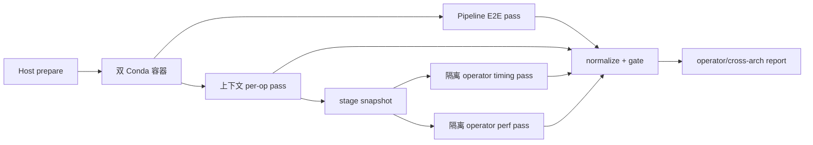

# Volc Operator Sim 黑盒适配功能设计说明书

## 0.1 产品版本&密级

- 产品：`python-framework-analysis-pipeline`
- 设计版本：1.0
- 日期：2026-07-16
- 密级：内部公开

## 0.2 拟制信息

- 拟制：Codex
- 上游架构文档：`2026-07-16-volc-operator-sim-adaptation-architecture.md`

## 0.3 修订记录

| 版本 | 日期 | 变更说明 |
|---|---|---|
| 1.0 | 2026-07-16 | 首版，定义部署、E2E、逐算子和报告功能 |

## 0.4 Keywords 关键词

Host prepare、双 Conda、黑盒 runner、operator fan-out、perf record、artifact normalization。

## 0.5 Abstract 摘要

本功能设计把标准接入拆为三个功能项：持久化部署准备、Pipeline 与逐算子采集、标准化与对比报告。系统首先在 Host 下载并校验数据，随后运行不含数据的双 Conda 容器；采集阶段分别执行完整 Pipeline、上下文逐算子、隔离算子 timing 和隔离算子 profiling；最后把上游 artifact 转换为稳定 JSON/JSONL/CSV 契约并生成引擎与架构对比报告。

## 0.6 List of abbreviations 缩略语清单

| 缩略语 | 英文全称 | 中文名 |
|---|---|---|
| E2E | End-to-End | 端到端 |
| ROI | Region of Interest | 归因有效区间 |
| DJ | Data-Juicer | Data-Juicer 引擎 |
| FMEA | Failure Mode and Effects Analysis | 失效模式与影响分析 |
| DFX | Design for X | 可靠性、性能、安全等设计属性 |

## 0.7 前言

功能设计只定义能力、边界、接口和验收口径；具体 Python 类型、路径和伪代码见详细设计。

# 1 功能域：Volc Operator Sim 性能分析接入

## 1.1 功能域概述

### 1.1.1 功能域总述

本功能域面向性能工程师和流水线维护者，解决以下问题：

1. 如何在容器重建后仍保留大体量数据与结果。
2. 如何复用目标仓库正式流程，而不维护第二套 operator 实现。
3. 如何同时获得完整 Pipeline 和逐算子的端到端耗时、资源、perf 分布和机器码证据。
4. 如何避免把 perf sample share、估算 timing 或 smoke 数据误写成正式 wall-clock 性能结论。



## 1.2 功能域总体方案

| 功能项 | 输入 | 输出 | 失败边界 |
|---|---|---|---|
| Host 持久化部署准备 | project/environment config | download manifest、image、container、readiness | 不进入 benchmark |
| Pipeline 与逐算子采集 | task/group、input manifest、profile | raw result、operator timing、perf/资源/ASM | 单 case 隔离失败 |
| 标准化与对比报告 | raw artifact tree | normalized JSON/CSV、报告、质量判定 | 不删除 raw artifact |

## 1.3 功能域规格设计

- 首次验收：ARM/x86、六模态默认测试集、按 Pipeline 声明的引擎矩阵、smoke、1 round；完整十四条为扩展验收。
- 数据准备：Host `/home/lxy/de_bench_full` 持久化，容器只消费 bind mount。
- operator 范围：task 中全部非 sink operator；sink/finalize 作为独立 pseudo-stage。
- profiling：timing、perf stat、perf record、py-spy 分离跑次。
- 正式性能：只有上游 scale 门禁解封后才允许生成正式结论。

## 1.4 功能项：Host 持久化部署准备

### 1.4.1 功能概述

#### 1.4.1.1 功能项总述

该功能在 ARM/x86 Host 上创建数据根、预下载原始数据与模型、生成 checksum manifest、构建多架构镜像并启动双 Conda 容器。下载不发生在容器可写层；canonical fixture 可由容器构建，但输出写回 Host。

### 1.4.2 实现思路

按 `prepare-host-data → verify-host-data → build-image → reconcile-container → build-fixtures → readiness` 顺序生成 PlanStep。每一步幂等并带 rollback 提示。Host 下载使用断点续传、临时文件、校验和原子替换。

### 1.4.3 实现设计

#### 1.4.3.1 Host 数据准备功能实现设计

Host 数据目录：

```text
/home/lxy/de_bench_full/
  raw/
  models/
  fixtures/
    raw/                  # smoke builder 的持久化合成源
  operator-cache/
  bench-results/pyframework/
  manifests/
```

下载清单包含 source id、URL、目标路径、期望大小、sha256、状态和完成时间。`raw`、`models` 在 runtime 默认只读；`fixtures`、`operator-cache`、`bench-results` 可写。为兼容上游 smoke builder，只将 Host `fixtures/raw` 作为嵌套可写挂载映射到容器 `raw/min_fixtures`，不放开整个真实 raw 目录。

#### 1.4.3.2 双 Conda 容器功能实现设计

镜像包含目标仓库固定 revision、Miniforge、`xarch`、`xdj`、系统媒体依赖、perf/objdump/readelf/py-spy。运行时将 Host 数据根挂载到同一路径，配置 `--shm-size`、CPU/NUMA 策略和 perf capabilities。

### 1.4.4 增量SR清单

| SR | 描述 |
|---|---|
| SR-ENV-001 | 新增 `volcoperatorsim` environment adapter |
| SR-ENV-002 | 新增 Host 数据 prepare/verify PlanStep |
| SR-ENV-003 | 新增 ARM/x86 原生镜像构建脚本 |
| SR-ENV-004 | 新增双 Conda、perf 和数据 readiness |

### 1.4.5 实现接口设计

#### 1.4.5.1 实现接口设计

输入来自 `environment.yaml`；执行通过现有 SSH executor；结果写入 `environment-plan.json`、`environment-record.json` 和 Host manifest。

#### 1.4.5.2 实现接口定义

| 接口 | 输入 | 输出 |
|---|---|---|
| `get_plan_steps` | platform、software、hostRefs | `PlanStep[]` |
| `prepare_host_data` | data profile、root、source manifest | download manifest |
| `verify_container` | image、container、revision | readiness record |

### 1.4.6 功能规格设计

- 缺少 sha256 的外部下载只能进入 `warn`，不能进入 scale 数据准备。
- 同一文件已通过校验时不得重复下载。
- 容器重建不得删除 Host 数据根。
- readiness 必须验证两个 Python 路径、核心 import、perf stat/record 和目标 revision。

### 1.4.7 DFX分析

#### 1.4.7.1 可靠性分析

##### 1.4.7.1.1 FMEA分析

| 失效模式 | 影响 | 检测 | 处理 |
|---|---|---|---|
| 下载中断 | 数据不完整 | `.partial`、size/hash | 断点续传 |
| Host 磁盘不足 | 下载或结果失败 | 预检水位 | benchmark 前失败 |
| image 构建失败 | 无法运行 | build exit/log | 保留旧镜像，重试 |
| conda 依赖漂移 | 跨架构不可比 | lock fingerprint | 阻断 compare |

#### 1.4.7.2 可服务性分析

每个 PlanStep 输出命令、stdout/stderr、持续时间和 rollback；环境记录展示 image id、Conda package fingerprint、Host kernel/perf version。

#### 1.4.7.3 安全设计检查

##### 1.4.7.3.1 安全设计确认

不把 SSH key、token 或数据凭据写入镜像；下载 URL 使用 allowlist；源码 revision 固定。

##### 1.4.7.3.2 敏感操作检查

Docker build/run、Host 下载和 perf sysctl 属敏感操作，计划中设置 `requiresApproval`；禁止自动清理用户数据目录。

#### 1.4.7.4 可用性/性能分析

Host 缓存避免每次重建镜像重新下载；ARM/x86 可并行准备；同一 Host 使用文件锁避免两个 run 同时构建相同 fixture。

### 1.4.8 影响点列表

`cli/_common.py`、`config.py`、environment planning/preflight/deploy、adapter registry、参考项目和环境测试。

### 1.4.9 分配需求

满足 `REQ-ARCH-001`、`REQ-ARCH-004` 与 `REQ-ARCH-005` 的环境和输入前置条件。

## 1.5 功能项：Pipeline 与逐算子采集

逐算子分析配置位于 `workload.operatorAnalysis`。需要只采集正式分组中的部分
pipeline 时，可用 `group` 指定目标正式分组，并用 `tasks` 给出 pipeline ID
白名单；该白名单同时约束 Pipeline E2E 和后续逐算子阶段。执行计划会拒绝不属于
该分组的 ID，避免 E2E 静默运行整个 group 或逐算子阶段误跑其他任务。

### 1.5.1 功能概述

#### 1.5.1.1 功能项总述

该功能同时采集完整 Pipeline 和 operator 级证据。业务执行仍由目标仓库完成。本项目只生成运行参数、派生单算子 task、stage snapshot 和采集 wrapper，并解析目标 result/artifact。

### 1.5.2 实现思路

执行四个相互隔离的 pass：

1. `pipeline_e2e`：未配置 `tasks` 时运行正式 `run_all_pipelines.sh`；配置
   `tasks` 时逐条运行派生 full-task overlay，获得同一白名单的完整 E2E。
2. `pipeline_context`：`materialize_policy=per_op`、`fuse_mappers=false`，获得链路内 operator timing。
3. `operator_case_e2e`：每个 operator 使用冻结 stage input 独立运行，获得该 case 完整 wall-clock。
4. `operator_case_perf`：相同 case 独立 `MODE=perfrecord/profile`，获得 CPU sample、火焰图、RSS 和 ASM。

### 1.5.3 实现设计

#### 1.5.3.1 Pipeline E2E 功能实现设计

首次验收从 `target_14` 中显式选择六条默认 Pipeline，并使用 `PROFILE_NAME=smoke ROUNDS=1`。Adapter 逐条执行 full-task overlay，为每个平台设置独立 `OUT_ROOT`，防止 group 内其他 Pipeline 或历史结果混入。本 pass 只做轻量 perf stat/proc sampler，不做重型 profiling。扩展项目显式选择原十四条。

#### 1.5.3.2 上下文逐算子功能实现设计

Daft 使用现有 `operator_timings` 和真实 `op_boundaries`。关闭 mapper fusion 后，一个执行组尽量对应一个 operator；仍发生框架级融合时按 execution group 报告，不虚拆。

DJ 使用日志解析的 `operator_timings`。只有 `source=data_juicer_log` 才视为可比较；`estimated_even_split` 只保留诊断记录，质量等级为 C。

#### 1.5.3.3 隔离算子功能实现设计

OperatorPlanner 按 task 顺序生成 case：

- 第一个 operator 直接使用 task canonical input。
- 后续 operator 使用前一 stage 的冻结 Lance + JSONL mirror。
- stage snapshot 由“原 task 前缀 + 末尾 `write_lance`”派生 task 交给目标 runner 生成；适配层只读回 Lance 并导出同源 JSONL/sidecar，不复制 operator 逻辑。
- stage snapshot 由固定 reference producer 生成，并记录 producer、schema、row/file/byte/checksum fingerprint。
- Daft 与 DJ 必须读取同一 stage snapshot；不满足 parity 时该 operator 禁止横比。
- sink 不作为业务 operator，单独记录 `__finalize__` 或 `__write_lance__`。

派生 task 位于 Host run-specific 只读 overlay，通过 `bench_capture.sh -- <raw command>` 把绝对 task 路径传给目标 `run_perf_suite.py`，不写回目标仓库 `tasks/`。

隔离 case 回答“相同输入下该 operator implementation 的完整 E2E 与 CPU 分布”，不替代真实 Pipeline 上下文 timing。

#### 1.5.3.4 perf 归因功能实现设计

每个隔离 operator case 产生：

- `perf-stat.txt`：cycles、instructions、IPC、cache/branch、context switches、faults。
- `perf.data`、`perf-script.txt`、`perf-report.txt`。
- `perf_records.csv`：symbol/DSO/category/sample period。
- `cpu.svg` 或折叠栈火焰图。
- top-N symbol 的 `perf annotate` 与 objdump ASM。
- `samples.jsonl`、CPU/RSS summary。

perf category share 表示采样 CPU-time 分布，不表示 wall-clock。报告可以给出 `estimated_cpu_time_s`，但字段名和质量标签必须明确。

### 1.5.4 增量SR清单

| SR | 描述 |
|---|---|
| SR-COL-001 | 新增可选 `OperatorAnalysisAdapter` 协议 |
| SR-COL-002 | 新增 task/operator planner 与稳定 operator id |
| SR-COL-003 | 新增 stage snapshot 与 parity manifest |
| SR-COL-004 | 新增 context/isolated timing pass |
| SR-COL-005 | 新增 per-operator perf/profile/ASM pass |

### 1.5.5 实现接口设计

#### 1.5.5.1 实现接口设计

基础 adapter 仍返回整体 `timing-normalized.json`；operator 扩展返回 operator acquisition manifest，后续 normalize 不依赖远端进程状态。

#### 1.5.5.2 实现接口定义

| 接口 | 输入 | 输出 |
|---|---|---|
| `plan_operator_cases` | task docs、input manifests | operator plan |
| `collect_context_timing` | plan、platform、engine | raw context timing |
| `collect_operator_timing` | operator case | isolated result |
| `collect_operator_profile` | operator case、perf spec | perf artifact directory |
| `build_operator_manifest` | raw artifacts | acquisition manifest |

### 1.5.6 功能规格设计

- `operator_case_id` 对 task id、order、op name、params hash 稳定。
- 所有计时单位在标准化层转换为 ns，原始秒值保留 source pointer。
- timing pass 与 profile pass 使用不同 run id。
- operator case 的 warmup、rounds、CPU set、输入 fingerprint 和引擎预算必须记录。
- 样本量低于 profile 阈值时自动重跑一次；仍不足则标 `insufficient_samples`。
- 目标进程失败时仍回收 result、stdout/stderr 和 perf artifact。

### 1.5.7 DFX分析

#### 1.5.7.1 可靠性分析

##### 1.5.7.1.1 FMEA分析

| 失效模式 | 影响 | 检测 | 处理 |
|---|---|---|---|
| stage input 不同源 | operator 对比无效 | fingerprint mismatch | 隔离比较，保留单边数据 |
| Daft op boundary 被剪枝 | context timing 失真 | 窗口覆盖/增长检查 | 使用 collect、降级质量 |
| DJ 日志解析失败 | 无真实 per-op timing | source=fallback | 禁止速度结论，依赖 isolated case |
| perf 样本太少 | 分布不稳定 | sample_count/period | 提高工作量或频率重跑 |
| PMU 事件不支持 | 部分指标缺失 | perf stderr | 输出 `unsupported`，不填 0 |

#### 1.5.7.2 可服务性分析

每个 operator case 拥有独立目录、command、environment fingerprint、result、logs 和 complete marker，可单独重跑。

#### 1.5.7.3 安全设计检查

##### 1.5.7.3.1 安全设计确认

派生 task 只引用 allowlisted operator 与 Host 数据根下路径；params 经 JSON schema 验证。

##### 1.5.7.3.2 敏感操作检查

perf attach、ptrace、读取 `/proc` 和特权 capability 必须记录；不得 attach 到容器外进程。

#### 1.5.7.4 可用性/性能分析

逐算子 fan-out 运行量较大。默认同平台串行，平台间并行；snapshot 以 fingerprint 缓存；只对支持隔离的 operator 运行重型 profiling。

### 1.5.8 影响点列表

adapter contracts、orchestrator substeps、acquisition manifest、perf parsing、machine-code collection、tests。

### 1.5.9 分配需求

满足 `REQ-ARCH-002`、`REQ-ARCH-003`、`REQ-ARCH-004`。

## 1.6 功能项：标准化、质量门禁与对比报告

### 1.6.1 功能概述

#### 1.6.1.1 功能项总述

该功能把目标仓库多层 artifact 转为本项目稳定契约，按 task/engine/platform/operator 聚合，并输出整体与逐算子报告。任何结论必须携带 profile、quality 和 input parity。

### 1.6.2 实现思路

保留现有 `timing-normalized.json` 和 pipeline `perf_records.csv`，新增 operator 专用文件，避免破坏现有消费者：

```text
timing/operator-timing-normalized.json
operators/operator-records.jsonl
operators/operator-summary.csv
operators/perf/operator-perf-records.csv
operators/acquisition-manifest.json
reports/operator-compare.md
```

### 1.6.3 实现设计

#### 1.6.3.1 Timing 标准化功能实现设计

Pipeline case 写入整体 E2E；`pipeline_context` 与 `operator_case_e2e` 分别保存为独立事实记录，报告再按 task/version/operator/order/params key 关联，避免把原链路增量耗时与隔离 case E2E 混成同一测量。统计字段包含 raw rounds、median、p95、stddev、CV、throughput、timing source 和 quality。

#### 1.6.3.2 Perf 标准化功能实现设计

沿用现有 symbol/DSO/category 字段，新增 task、engine、operator case、measurement scope、period share、sample quality。pipeline perf 与 operator perf 不合并为同一行集。

#### 1.6.3.3 对比报告功能实现设计

报告至少包含：

1. Pipeline E2E：ARM/x86 × Daft/DJ。
2. 输入同源与 perf-lock 表。
3. Pipeline context operator timing 表。
4. Isolated operator E2E 表。
5. 每 operator 的 perf category、top symbol、IPC/L1D/branch/RSS 表。
6. 质量与不可比原因清单。

速度比仅在 task/operator/input/profile/engine 口径匹配且质量门禁通过时计算。

### 1.6.4 增量SR清单

| SR | 描述 |
|---|---|
| SR-REP-001 | 新增 operator timing/perf schema |
| SR-REP-002 | 新增 operator artifact normalizer |
| SR-REP-003 | 新增 operator compare aggregation |
| SR-REP-004 | 新增 Markdown/CSV/JSON 报告 |

### 1.6.5 实现接口设计

#### 1.6.5.1 实现接口设计

normalizer 只接受 acquisition manifest，避免递归猜目录成为长期接口。artifact discovery 只在 adapter 内部使用。

#### 1.6.5.2 实现接口定义

| 接口 | 输入 | 输出 |
|---|---|---|
| `normalize_operator_artifacts` | acquisition manifest | operator records |
| `validate_operator_records` | records、quality policy | validation report |
| `compare_operator_records` | ARM/x86 records | comparison model |
| `render_operator_report` | comparison model | Markdown/CSV/JSON |

### 1.6.6 功能规格设计

质量等级：

| 等级 | 定义 | 可用范围 |
|---|---|---|
| A | 真实 timing/boundary、同源输入、样本充足、lock 通过 | 可做诊断对比；scale 解封后可进正式表 |
| B | 日志 timing 或 isolated case 完整，但缺上下文边界 | 可做诊断，必须披露限制 |
| C | 均分估算、样本不足、边界无效或输入未对齐 | 只展示原始事实，不计算 speedup |

`smoke` 即使质量 A，也只能证明流程和诊断 artifact 可用。

### 1.6.7 DFX分析

#### 1.6.7.1 可靠性分析

##### 1.6.7.1.1 FMEA分析

| 失效模式 | 影响 | 检测 | 处理 |
|---|---|---|---|
| raw schema 漂移 | normalize 失败 | schema version/required fields | 明确报错并保留 raw |
| 历史结果混入 | 统计错误 | run namespace/revision | 只读当前 manifest |
| 单位误用 | 数量级错误 | schema/unit tests | 标准字段固定 ns/suffix |
| 估算值进入正式表 | 错误结论 | quality gate | 阻断 speedup |

#### 1.6.7.2 可服务性分析

validation report 精确列出缺失字段、artifact 路径、operator case、平台和建议重跑命令。

#### 1.6.7.3 安全设计检查

##### 1.6.7.3.1 安全设计确认

报告不嵌入环境 token、SSH key 或完整敏感路径；必要路径做 configurable redaction。

##### 1.6.7.3.2 敏感操作检查

该功能只读 raw artifact 并写本地报告，不执行远程敏感操作。

#### 1.6.7.4 可用性/性能分析

CSV/JSONL 采用流式读取；perf.data 不复制进最终报告，只保留索引；top-N 和聚合先于 Markdown 渲染。

### 1.6.8 影响点列表

contracts、analyze/compare/render、CLI compare、测试与 README；不影响四层 backfill 默认行为。

### 1.6.9 分配需求

满足全部架构需求，尤其是 `REQ-ARCH-003` 与 `REQ-ARCH-005`。
